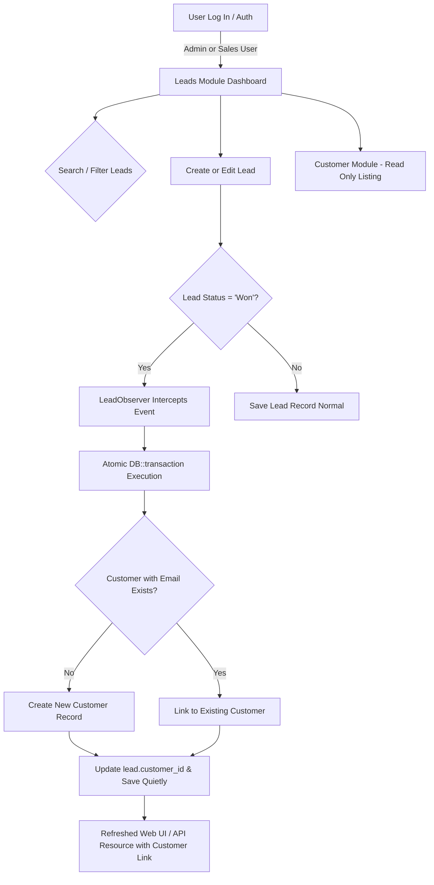

# CRM Lead & Customer Tracking System
> **PHP Team Leader Machine Test Assessment Implementation**

A full-stack Laravel & MySQL solution fulfilling all requirements of the **PHP Team Leader Machine Test Assessment**.

---

## 🔄 Complete Step-by-Step Architecture Flow



### 1. Authentication & Session Initialization
1. User visits `/login` (or accesses any route).
2. Authenticates using **Session** (Web UI) or **Sanctum Bearer Token** (REST API).
3. The system identifies the user's role:
   - **`admin`**: Full access (Create, Edit, Delete Leads, View Customers).
   - **`sales_user`**: Create & Edit Leads, View Customers (Delete restricted).

---

### 2. Lead Management & Filtering Flow
1. User navigates to **Leads Module** (`/leads`).
2. The controller loads paginated records (`5` or `10` per page).
3. Search input filters leads by `name`, `email`, or `company`.
4. Filter dropdowns narrow leads by `Status` (`New`, `In Progress`, `Won`, `Lost`), `Source` (`Web`, `Ads`, `Referral`), `Assigned Sales User`, or `Per Page` count.

---

### 3. Automated Lead Conversion Flow *(Core Business Requirement)*
1. User creates a lead or updates an existing lead's status to **`"Won"`** (or clicks the **Trophy/Convert** button on the table).
2. **`LeadObserver`** intercepts the `created` or `updated` Eloquent event.
3. Inside a thread-safe **`DB::transaction()`**:
   - Searches the `customers` table by `email`.
   - If no customer exists, creates a new `Customer` record with `name`, `email`, `phone`, and `company`.
   - Assigns `customer_id` to the lead and executes `saveQuietly()` (preventing recursive observer loops).
4. The UI instantly displays a green **`Converted (#id)`** badge linking directly to that customer's details.

---

### 4. Customer Module Flow
1. User navigates to **Customers Module** (`/customers`).
2. Read-only listing displays converted active customers, contact details, total linked won leads count, and conversion timestamps.
3. Includes search filter by customer name, email, or company.

---

### 5. Role-Based Authorization Flow (RBAC)
1. When a **Sales User** attempts to delete a lead:
   - UI locks/disables the delete button.
   - If bypassed or attempted via API, controller returns `HTTP 403 Forbidden`.
2. When an **Admin** deletes a lead:
   - System confirms action and safely deletes the record.

---

---

## 🛠️ Quick Setup Instructions

### Prerequisites
* **PHP:** >= 8.2
* **MySQL Database:** Running on `127.0.0.1:3306`
* **Composer** & **Node.js**

---
### Setup Commands

```bash
# 1. Navigate to backend directory
cd backend

# 2. Configure Database in .env
# DB_DATABASE=crmleadtracker
# DB_USERNAME=root
# DB_PASSWORD=

# 3. Run Migrations & Seed Sample Data
php artisan migrate:fresh --seed

# 4. Run Automated Test Suite
php artisan test

# 5. Start the Development Server
php artisan serve
```

Access the application at `http://127.0.0.1:8000`.

---

## 🔑 Pre-Configured Test Credentials

| Role | Email | Password | Allowed Permissions |
| :--- | :--- | :--- | :--- |
| **Admin** | `admin@crm.com` | `password123` | Full access (Add, Edit, Delete Leads, View Customers) |
| **Sales User** | `sales@crm.com` | `password123` | Add & Edit Leads, View Customers (Delete locked) |
| **Sales User** | `john.sales@crm.com` | `password123` | Add & Edit Leads, View Customers |


## 🚀 Key Features & System Modules

### 1. Authentication & Role-Based Access Control (RBAC)
* **Session & Sanctum Token Auth:** Web session login/logout alongside Sanctum bearer token REST authentication.
* **Role Types:**
  * **Admin:** Full access (Create, Read, Update, Delete Leads; manage users).
  * **Sales User:** View, Create, and Edit Leads; restricted from deleting leads.
* **1-Click Demo Switcher:** Built-in demo role switcher in the UI header and login screen to test permissions instantly.

---

### 2. Lead Module
* **Full CRUD Operations:** Add, List, Edit, and Delete leads.
* **Lead Fields:** `Name`, `Email`, `Phone`, `Company`, `Source` (`Web`, `Ads`, `Referral`), `Status` (`New`, `In Progress`, `Won`, `Lost`), `Assigned To` (User relationship), `Follow-up Date`, `Notes`, `Customer ID` link.
* **Automatic Conversion Logic:**
  * Driven by **`LeadObserver`** and wrapped in atomic **`DB::transaction()`**.
  * When a lead status is set or updated to **`Won`**, it automatically creates a corresponding **`Customer`** record (or links to an existing customer with matching email) and assigns `customer_id` quietly.

---

### 3. Customer Module
* **Read-Only Listing Page:** Display all converted active customers.
* **Customer Fields:** `Name`, `Email`, `Phone`, `Company`, `Linked Won Leads Count`, `Conversion Timestamp`.

---

### 4. RESTful API & Swagger Documentation
* **Interactive Swagger UI:** `http://127.0.0.1:8000/docs` (or `/api/documentation`)
* **OpenAPI 3.0 JSON Spec:** `http://127.0.0.1:8000/swagger.json`
* `POST /api/login` - Authenticate & obtain Sanctum plainTextToken.
* `POST /api/logout` - Revoke current access token.
* `GET /api/me` - Authenticated user info.
* `GET /api/leads` - List leads (with search, status/source filters, pagination).
* `POST /api/leads` - Store new lead (triggers auto-conversion if status `Won`).
* `GET /api/leads/{id}` - Show lead details.
* `PUT /api/leads/{id}` - Update lead details (triggers auto-conversion if status updated to `Won`).
* `DELETE /api/leads/{id}` - Delete lead (Admin role required).
* `GET /api/customers` - List converted customers (with search & pagination).
* `GET /api/customers/{id}` - Show customer details.

---

### 5. Search & Pagination Features
* **Search Functionality:**
  * Multi-column SQL `LIKE` search on `name`, `email`, and `company` fields across both Web UI and REST API.
  * Web UI retains active search & filter query parameters across pagination (`->withQueryString()`).
  * Additional filters for Lead `Status`, Lead `Source`, `Assigned User`, and `Per Page` items (`5`, `10`, `25`).
* **Pagination Functionality:**
  * Built-in Laravel Eloquent pagination (`->paginate($perPage)`).
  * API endpoints accept custom `per_page` query parameter and return structured metadata (`current_page`, `last_page`, `per_page`, `total`).
  * Web UI renders Bootstrap 5 pagination controls with record range indicators (`Showing 1 to 5 of X records`) and Next/Previous navigation buttons.

---

### 6. Code Quality & Technical Requirements
* **Form Requests:** `StoreLeadRequest`, `UpdateLeadRequest`, `LoginRequest`.
* **API Resources:** `LeadResource`, `CustomerResource`, `UserResource`.
* **PSR-12 Compliant:** Code formatted using **Laravel Pint**.
* **Automated Tests:** 100% passing PHPUnit feature test suite covering conversion logic, Sanctum API auth, RBAC permissions, search, and pagination.

---

## 🧪 Comprehensive Guide: How to Test Every Module

You can test the system using **3 methods**:

---

### Method A: Visual Testing in Web Browser

1. **Open Application**:
   Navigate to `http://127.0.0.1:8000` in your browser.

2. **Test Authentication & 1-Click Role Switcher**:
   - On the login screen, click **"Fill Sales User Account"** (`sales@crm.com` / `password123`) and click **Sign In**.
   - Notice the role badge in the top right navbar displays **`SALES USER`**.

3. **Test Search & Pagination**:
   - In the search bar on `/leads`, type `"Acme"` and click **Filter** $\rightarrow$ verifies search functionality.
   - Filter by status `"In Progress"` $\rightarrow$ verifies single-line status badge formatting and Next/Previous controls.

4. **Test Automatic Lead-to-Customer Conversion**:
   - Click **"Add New Lead"**.
   - Enter:
     - **Name**: `TechCorp Solutions`
     - **Email**: `contact@techcorp.io`
     - **Company**: `TechCorp Inc`
     - **Source**: `Web`
     - **Status**: **`Won`**
   - Click **Save Lead**.
   - **Verification**: Notice the green success alert and the green **`Converted (#id)`** badge next to the lead.
   - Click **Customers Module** in navbar $\rightarrow$ verify `TechCorp Solutions` (`contact@techcorp.io`) is now listed as a Customer!

5. **Test Role Authorization (Admin vs Sales User)**:
   - As **Sales User**, notice the Delete button on the leads table is disabled with a lock icon.
   - Click **"Demo Switch Role"** in top navbar $\rightarrow$ select **Admin** (`admin@crm.com`).
   - Notice the role badge updates to **`ADMIN`** and the Delete button is now an active red trash icon.

---

### Method B: Automated PHPUnit Test Suite

Open your terminal in `f:\crmleadtracker\backend` and run:

```bash
php artisan test
```

#### Expected Output:
```text
   PASS  Tests\Unit\ExampleTest
  ✓ that true is true

   PASS  Tests\Feature\ExampleTest
  ✓ the application login page loads successfully

   PASS  Tests\Feature\LeadApiTest
  ✓ unauthenticated api request returns 401
  ✓ api login returns token and user details
  ✓ authenticated user can fetch leads via api
  ✓ leads api search filtering and pagination
  ✓ creating lead via api with won status auto converts customer
  ✓ authenticated user can fetch customers via api
  ✓ customers api search and pagination

   PASS  Tests\Feature\LeadConversionTest
  ✓ lead created with status won automatically converts to customer
  ✓ updating lead status to won converts lead to customer
  ✓ converting lead with existing customer email links without duplication
  ✓ only admin can delete lead

  Tests:    13 passed (67 assertions)
```

---

### Method C: Testing REST APIs (Postman / cURL / Thunder Client)

#### 1. Authenticate & Obtain Token
```bash
curl -X POST http://127.0.0.1:8000/api/login \
  -H "Content-Type: application/json" \
  -d '{"email":"admin@crm.com","password":"password123"}'
```
*Returns Sanctum `token` string.*

#### 2. Fetch Paginated & Filtered Leads
```bash
curl -X GET "http://127.0.0.1:8000/api/leads?search=Acme&per_page=5" \
  -H "Authorization: Bearer <YOUR_TOKEN>"
```

#### 3. Create Lead with Status "Won" via API (Triggers Auto-Conversion)
```bash
curl -X POST http://127.0.0.1:8000/api/leads \
  -H "Authorization: Bearer <YOUR_TOKEN>" \
  -H "Content-Type: application/json" \
  -d '{
    "name": "API Enterprise Lead",
    "email": "api@enterprise.com",
    "company": "Enterprise Global",
    "source": "Ads",
    "status": "Won"
  }'
```
*Returns `is_converted: true` and populated `customer` object in JSON.*

